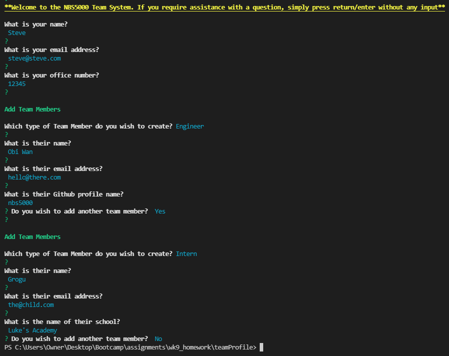

## Team Profile CLI - Steve Barry

##  The Task

The task was to build a Node.js command-line application that takes in information about employees on a software engineering team, then generate an HTML webpage that displays summaries for each person. Additionally, the module must include a unit test for every part of your code and ensure that it passes each test, these should be run by entering npm run test.

### ⭐ ⭐ S.T.A.R. ⭐ ⭐

**SITUATION**

The provided user story was: 

> AS A manager
> 
> I WANT to generate a webpage that displays my team's basic info
>
> SO THAT I have quick access to their emails and GitHub profiles

**TASK**

Provide a CLI solution that allows a manager to create an HTML webpage with basic information for their team, including email & Github links.

**ACTION**

Writing of a solution to resolve the situation, including:
* Layout
  * *Layout is responsive and functional on various screen sizes*
  * *Simple, yet attractive design*
  * *Logical layout*
  * *Improved code visualisation - eg: indentation*
  * *Error free loading*
  * *Favicon designed and added*
* Javascript
  * *Error free performance*
  * *Multiple functions to separate aspects of code*
  * *Thorough comments*
* GIT
  * *Numerous commits to track changes in code*
  * *Code added to public repository and Github Pages for public viewing*
* Functionality
  * *Simple questions, with assistance to users if needed*
  * *Looping of adding team members, and exiting when finished*
  * *Team members reordered to seniority level: Manager > Engineer > Intern*
  * *HTML generated*
  * *Links connect to the email/Github addresses*

**RESULT**

The end code is stored on Github, and publicly available and viewable. This result meets all requirements of the User Story and acceptance criteria:

* ~~GIVEN a command-line application that accepts user input~~
* ~~WHEN I am prompted for my team members and their information~~
* ~~THEN an HTML file is generated that displays a nicely formatted team roster based on user input~~
* ~~WHEN I click on an email address in the HTML~~
* ~~THEN my default email program opens and populates the TO field of the email with the address~~
* ~~WHEN I click on the GitHub username~~
* ~~THEN that GitHub profile opens in a new tab~~
* ~~WHEN I start the application~~
* ~~THEN I am prompted to enter the team manager’s name, employee ID, email address, and office number~~
* ~~WHEN I enter the team manager’s name, employee ID, email address, and office number~~
* ~~THEN I am presented with a menu with the option to add an engineer or an intern or to finish building my team~~
* ~~WHEN I select the engineer option~~
* ~~THEN I am prompted to enter the engineer’s name, ID, email, and GitHub username, and I am taken back to the menu~~
* ~~WHEN I select the intern option~~
* ~~THEN I am prompted to enter the intern’s name, ID, email, and school, and I am taken back to the menu~~
* ~~WHEN I decide to finish building my team~~
* ~~THEN I exit the application, and the HTML is generated~~
* ~~WHEN I run npm run test~~
* ~~THEN Jest will be used to run a suite of tests on each module of the application~~
* ~~WHEN the suite of tests are run~~
* ~~THEN there are no fails or errors~~

##  The Outcome

As the acceptance criteria has been met and exceeded, the task is now complete. 

You can view the Github repo here [HERE](https://github.com/NBS5000/teamProfile/)

Alternatively, here is a screenshot:

> 

---

Written by Steve Barry - Due date 14/02/2022

© 2021 Trilogy Education Services, LLC, a 2U, Inc. brand. Confidential and Proprietary. All Rights Reserved.

